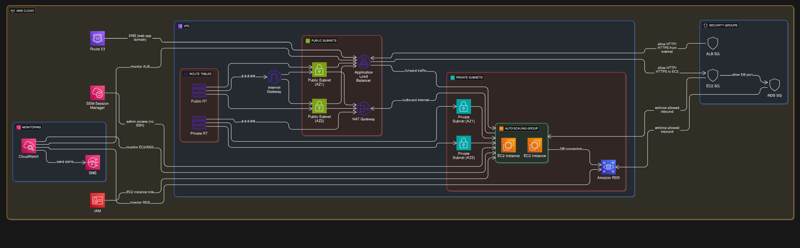

# Scalable Web Application with ALB and Auto Scaling

## 1. Project Overview

This project deploys a scalable and highly available web application on AWS using EC2, ALB, and Auto Scaling. It automatically scales based on demand, ensures high availability, and integrates with CloudWatch for continuous monitoring and alerting. Optionally, an RDS database is used for backend storage.
It demonstrates best practices for compute scalability, security, and cost optimization.

## 2. Solution Architecture 
The architecture is designed for high availability, fault tolerance, and scalability. Traffic enters through an Application Load Balancer, which distributes it across multiple EC2 instances running the web application. These instances are managed by an Auto Scaling Group, ensuring that the number of active instances adjusts dynamically based on demand. An optional Amazon RDS instance provides a highly available, managed database backend.

**Traffic Flow:**

- Users initiate a request to the web application's domain name (e.g., www.example.com).
- This request is first sent to a DNS service (like Amazon Route 53), which resolves the domain name to the ALB's IP address.
- The user's browser then accesses the web application via the ALB's IP address (which is associated with its DNS name).
- The ALB distributes incoming requests to healthy EC2 instances across multiple Availability Zones.
- The Auto Scaling Group monitors the health and performance of the EC2 instances.
- If demand increases (e.g., CPU utilization rises), the ASG launches new instances. If demand decreases, it terminates instances to save costs.
- EC2 instances connect to the Amazon RDS database for data storage and retrieval.

## 3. Key AWS Services Used

- **Amazon VPC:** Creates the isolated network for all project resources.
- **Subnets:** Divides the VPC into public (for ALB) and private (for EC2, RDS) segments.
- **Route Tables:** Controls network traffic flow within the VPC.
- **Internet Gateway (IGW):** Connects the public subnets to the internet.
- **NAT Gateway (NAT GW):** Enables private EC2 instances to access the internet securely.
- **Security Groups (SG):** Acts as virtual firewalls for instances and services.
- **Amazon EC2:** Provides the virtual servers hosting the web application.
- **Application Load Balancer (ALB):** Distributes web traffic for high availability.
- **Auto Scaling Group (ASG):** Automatically scales EC2 instances based on demand.
- **Amazon RDS:** Provides the highly available backend database.
- **IAM:** Manages access and permissions for AWS resources.
- **Amazon CloudWatch & SNS:** Monitors application performance and sends alerts.
- **AWS Systems Manager (SSM) Session Manager:** Enables secure administrative access to EC2 instances.
- **Amazon Route 53:** Manages DNS for the web application's custom domain.

# 4. Project Deployment Guide

This guide provides the steps required to deploy the scalable web application.

**4.1. Network Foundation**

- Create a VPC: Define your virtual network with a CIDR block (e.g., 10.0.0.0/16).
- Create Subnets: Set up at least two Public Subnets in different Availability Zones (e.g., 10.0.1.0/24 in us-east-1a, 10.0.2.0/24 in us-east-1b) and at least two Private Subnets in different Availability Zones (e.g., 10.0.11.0/24 in us-east-1a, 10.0.12.0/24 in us-east-1b).
- Create an Internet Gateway (IGW): Attach to your VPC for internet connectivity.
- Create a Public Route Table and associate it with your public subnets, adding a default route (0.0.0.0/0) pointing to the Internet Gateway (IGW). Create a Private Route Table and associate it with your private subnets, adding a default route (0.0.0.0/0) pointing to the NAT Gateway

**4.2. Security Group Creation & Configuration**

- Create ALB Security Group:
  - Inbound Rules: Allow HTTP (port 80) and HTTPS (port 443) traffic from 0.0.0.0/0 (internet).
  - Outbound Rules: Allow all outbound traffic to the EC2 Security Group on the application's listening ports (e.g., 80, 443).

- Create EC2 Security Group:
  - Inbound Rules: Allow inbound traffic on application ports (e.g., 80 for HTTP, 443 for HTTPS) only from the ALB Security Group. Allow inbound database port (e.g., 3306 for MySQL) only from the RDS Security Group. Do NOT open inbound SSH (port 22) or RDP (port 3389) from the internet; use SSM Session Manager.
  - Outbound Rules: Allow outbound traffic to the RDS Security Group on the database port (e.g., 3306). Allow all outbound traffic to 0.0.0.0/0 (internet) for updates, external API calls, etc. (typically routed via NAT Gateway).

- Create RDS Security Group:
  - Inbound Rules: Allow inbound traffic on the database port (e.g., 3306 for MySQL) only from the EC2 Security Group. Do not expose RDS to the internet.
  - Outbound Rules: Allow outbound traffic to the EC2 Security Group on the database port (e.g., 3306). (While connections are typically initiated from EC2, explicit outbound allows responses).

**4.3. IAM Role Configuration**
- Create IAM Role for EC2: Grant necessary permissions for EC2 instances (e.g., AmazonSSMManagedInstanceCore for Session Manager).

**4.4. EC2 Instance Preparation (AMI)**
- Prepare AMI: Launch a temporary EC2 instance, install your web application and dependencies, test, create an AMI from it, and then terminate the temporary instance.

**4.5. Database Setup (Amazon RDS)**
- Launch RDS Instance: Choose engine (e.g., MySQL), Multi-AZ for high availability, and manage credentials securely. leverage AWS Secrets Manager for database credential storage and retrieval.

**4.6. Application Load Balancer (ALB) Setup**
- Request/Import SSL/TLS Certificate (ACM): Use AWS Certificate Manager (ACM) to request a new public certificate or import an existing one for your domain. Ensure it's in the same region as your ALB.
- Create Target Group: Define the target type (e.g., EC2 instances), protocol (HTTPs), port (443 or your application port), and health check path. The Auto Scaling Group will later register its EC2 instances with this Target Group.
- Create Application Load Balancer: Set as Internet-facing, select public subnets across at least two AZs, and associate it with the ALB Security Group.
- Configure Listeners:
Add an HTTPS (port 443) listener, associating it with the SSL/TLS certificate from ACM.
Add an HTTP (port 80) listener configured to redirect traffic to HTTPS (port 443) for secure communication.

**4.7. Auto Scaling Group (ASG) Setup**
- Create Launch Template: Define instance configuration using the prepared AMI, instance type, IAM role, and the configured EC2 Security Group.
- Create Auto Scaling Group: Use the launch template, select private subnets, and attach to the ALB's target group.
- Configure Group Size: Set desired, minimum, and maximum capacities (e.g., Desired: 2, Min: 2, Max: 4).
- Configure Scaling Policies: Implement target tracking policies (e.g., Target CPU Utilization at 60%) for automatic scaling.
- Configure Health Checks: Use ELB health checks for instance health monitoring.

4.8. Monitoring and Alerting
- Create CloudWatch Alarms: Set alarms for critical metrics to ensure operational health and proactive responses.
  - EC2/ASG: Monitor CPU Utilization (for scaling), Network I/O, Disk I/O, and Status Check Failed alarms.
  - ALB: Monitor Healthy Host Count, HTTPCode_Target_5XX_Count (application errors), TargetConnectionErrorCount, and Latency.
  - RDS: Monitor CPU Utilization, Database Connections, FreeableMemory, DiskQueueDepth, and ReplicaLag (for Multi-AZ/Read Replicas).
- Create SNS Topic: Set up an SNS topic (e.g., email, SMS) to alert operations/admins teams.
- Integrate Alarms with SNS: Link CloudWatch alarms to the SNS topic for notifications when thresholds are breached.